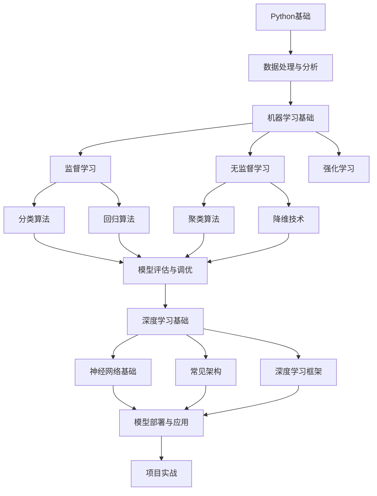

# AI学习指南

> 本笔记按照 AImaster 教学法构建，循序渐进，实例优先。

## 学习路线图

## 已学知识速查（AImaster 8步法）

### 第一阶段：Python与AI开发基础 ✅

| 状态 | 知识点 | 大小 | 笔记 |
|------|--------|------|------|
| ✅ | Python基础 + 数据结构 | — | 基础已具备 |
| ✅ | NumPy数组基础 | 12KB | [[NumPy数组基础]] |
| ✅ | Pandas数据处理基础 | 13KB | [[Pandas数据处理基础]] |
| ✅ | Matplotlib数据可视化 | 15KB | [[Matplotlib数据可视化基础]] |
| ✅ | Seaborn统计可视化 | 11KB | [[Seaborn统计可视化进阶]] |
| ✅ | 数据清洗 | 11KB | [[数据清洗]] |
| ✅ | Python面向对象编程 | 21KB | [[Python面向对象编程]] |
| ✅ | Python异常处理 | 14KB | [[Python异常处理]] |
| ✅ | Python文件操作/模块 | 21KB | [[Python文件操作与模块]] |

### 第二阶段：数学基础 ✅

| 状态 | 知识点 | 大小 | 笔记 |
|------|--------|------|------|
| ✅ | 数学基础：线性代数 | 17KB | [[数学基础线性代数]] |
| ✅ | 数学基础：概率与统计 | 19KB | [[数学基础概率与统计]] |

### 第三阶段：机器学习 ✅

| 状态 | 知识点 | 大小 | 笔记 |
|------|--------|------|------|
| ✅ | 线性回归基础 | 5KB | [[线性回归基础]] |
| ✅ | Scikit-learn机器学习基础 | 21KB | [[Scikit-learn机器学习基础]] |

## 专业名词速查

共 30+ 个术语，详见 [[学习进度]]

## 下一步学习计划

1. **模型评估与交叉验证** — 深入评估方法
2. **特征工程** — 特征选择、特征提取
3. **深度学习基础** — 神经网络、CNN、RNN

---

> 📌 **提示**：本指南配套代码见 [[AI学习代码]] 文件夹
