# AI学习进度追踪

## 当前状态

- **开始日期**：2026-04-07
- **当前阶段**：Scikit-learn 机器学习基础 ✅ 新完成
- **下一步**：机器学习进阶
- **最后更新**：2026-04-20

## 学习路线（进度概览）

```mermaid
graph LR
    A[Python基础] --> B[NumPy]
    B --> C[Pandas]
    C --> D[Matplotlib]
    D --> E[Seaborn]
    E --> F[数据清洗]
    F --> G[Scikit-learn]
    G --> H[机器学习进阶]
    H --> I[深度学习]
    I --> J[项目实战]
    
    style A fill:#90EE90
    style B fill:#90EE90
    style C fill:#90EE90
    style D fill:#90EE90
    style E fill:#90EE90
    style F fill:#90EE90
    style G fill:#90EE90
    style H fill:#FFD700
    style I fill:#D3D3D3
    style J fill:#D3D3D3
```

## 已学知识（AImaster 8步法笔记）

| 状态 | 知识点 | 大小 | 笔记 |
|------|--------|------|------|
| ✅ | NumPy数组基础 | 12KB | [NumPy数组基础](./已学知识/NumPy数组基础.md) |
| ✅ | Pandas数据处理基础 | 13KB | [Pandas数据处理基础](./已学知识/Pandas数据处理基础.md) |
| ✅ | Matplotlib数据可视化基础 | 15KB | [Matplotlib数据可视化基础](./已学知识/Matplotlib数据可视化基础.md) |
| ✅ | Seaborn统计可视化进阶 | 11KB | [Seaborn统计可视化进阶](./已学知识/Seaborn统计可视化进阶.md) |
| ✅ | Python面向对象编程 | 21KB | [Python面向对象编程](./已学知识/Python面向对象编程.md) |
| ✅ | Python异常处理 | 14KB | [Python异常处理](./已学知识/Python异常处理.md) |
| ✅ | Python文件操作与模块 | 21KB | [Python文件操作与模块](./已学知识/Python文件操作与模块.md) |
| ✅ | 数学基础：线性代数 | 17KB | [数学基础线性代数](./已学知识/数学基础线性代数.md) |
| ✅ | 数学基础：概率与统计 | 19KB | [数学基础概率与统计](./已学知识/数学基础概率与统计.md) |
| ✅ | 数据清洗 | 11KB | [数据清洗](./已学知识/数据清洗.md) |
| ✅ | **Scikit-learn机器学习基础** | 16KB | [Scikit-learn机器学习基础](./已学知识/Scikit-learn机器学习基础.md) |
| ✅ | 线性回归基础 | 5KB | [线性回归基础](./已学知识/线性回归基础.md) |

## 剩余内容

| 优先级 | 内容 | 说明 |
|--------|------|------|
| ⭐⭐⭐ | 模型评估与交叉验证 | sklearn 评估方法进阶 |
| ⭐⭐ | Git/Jupyter/Linux | 工具链（可后续补充） |

## 下一步学习计划

1. **模型评估与交叉验证** — 深入评估方法
2. **特征工程** — 特征选择、特征提取
3. **深度学习基础** — 神经网络、CNN、RNN

---

> 📝 每次学习后更新此文件
> 最后更新：2026-04-20
